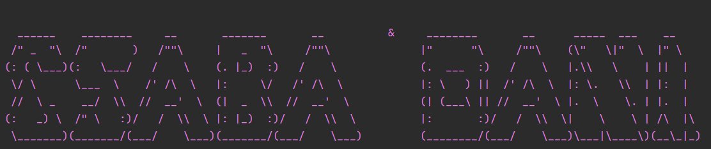

# Transactional Replication

# Adatbázis Replikációs Módszerek

A **snapshot replikáció** és a **transactional replikáció** két különböző típusú adatbázis-replikációs módszer, amelyek mindkettő arra szolgálnak, hogy az adatokat átvigyék egyik adatbázisból a másikba, de más-más módon és más céllal.

## 1. Snapshot Replikáció 📸

**Mi történik?**  
A snapshot replikáció minden egyes replikációs ciklus során az adatbázis teljes állapotát (snapshot) másolja át a replikált adatbázisra. Más szóval, amikor a replikáció történik, a cél adatbázis teljesen felülíródik a forrás adatbázis aktuális állapotával.

**Használati esetek:**

- Akkor hasznos, ha nem szükséges a replikáció folyamatos frissítése.
- Ha a forrás és a cél adatbázis gyakran frissül, és nem szükséges minden apró tranzakciót átvinni.
- Ideális statikus vagy ritkán változó adatok esetén.

**Előnyök:**

- Egyszerű beállítás és kezelés.
- Nincs szükség tranzakciós logokra, egyszerűen az adatokat egyből átülteti.

**Hátrányok:**

- Nem valós idejű, az adatokat csak a ciklusokban másolja át.
- Ha nagy adatbázisról van szó, időigényes lehet.

---

## 2. Transactional Replikáció 🔄

**Mi történik?**  
A transactional replikáció minden egyes tranzakciót másol át a forrás adatbázisból a cél adatbázisba. Tehát minden adatváltoztatás, mint INSERT, UPDATE, DELETE, valós időben tükröződik a replikált adatbázisban.

**Használati esetek:**

- Akkor hasznos, ha valós idejű adat szinkronizálásra van szükség.
- Ha a forrás adatbázis gyakran frissül, és minden egyes módosításnak azonnal meg kell jelenni a replikában.

**Előnyök:**

- Valós idejű szinkronizálás.
- Mivel a tranzakciók egyesével kerülnek replikálásra, a cél adatbázis mindig naprakész.
- Jobban skálázható dinamikusan változó adatoknál.

**Hátrányok:**

- Bonyolultabb beállítás és karbantartás.
- Magasabb erőforrás-igény a tranzakciók folyamatos figyelése és továbbítása miatt.

---

## Összehasonlítás

| Jellemző               | Snapshot Replikáció                               | Transactional Replikáció                          |
|------------------------|--------------------------------------------------|--------------------------------------------------|
| **Módszer**            | Teljes adatbázis másolása egy adott időpontban.  | Csak a tranzakciók átvitele, folyamatos szinkronizálás. |
| **Frissítés típusa**   | Ciklikus, időszakos teljes adatbázis másolása.  | Azonnali, minden egyes adatváltoztatás átvitele.   |
| **Használat**          | Ritkán változó, statikus adatbázisoknál.        | Dinamikusan változó adatoknál, real-time szinkronizálás. |
| **Kezelhetőség**       | Egyszerűbb, kevesebb beállítást igényel.        | Komplexebb beállítások, több erőforrást igényel.  |
| **Előnyök**            | Egyszerűség, könnyű karbantartás.               | Valós idejű adat szinkronizálás, naprakész másolat. |
| **Hátrányok**          | Nem valós idejű, időigényes, nem a leggyorsabb. | Erőforrás-igényes, bonyolultabb beállítás.       |

